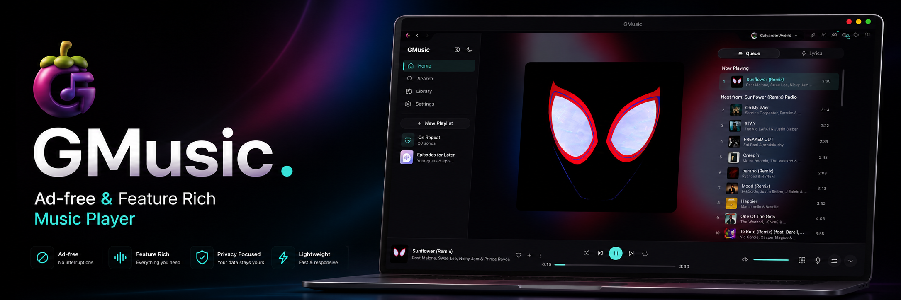

<div align="center">



# GMusic

**A native desktop YouTube Music client — Rust + Tauri, ad-free, no Electron.**

<p align="center">
  <a href="https://github.com/galyarderlabs/GMusic/releases/latest"></a>
  <a href="https://github.com/galyarderlabs/GMusic/releases/latest"></a>
  
  <br>
  
  
  
  
  

</div>

---

## About

GMusic is a high-performance desktop client for YouTube Music based on [Limusic](https://github.com/SimoHypers/limusic). It communicates directly with YouTube's internal APIs and plays audio through `libmpv` — no bundled Chromium, no Electron, no ads.

## Features

- **Ad-free playback** with `libmpv` loudness normalization and gapless transitions
- **Synced lyrics** — line-by-line & word-by-word via LRCLIB and Boidu
- **Discord Rich Presence** — shows what you're listening to with album artwork
- **Last.fm scrobbling** — built-in scrobbler, no external plugins needed
- **Theme engine** — 10 preset themes including Liquid Glass, plus custom accent colors, hue tinting, fonts, and artwork-adaptive colors
- **Multi-language** — English, Bahasa Indonesia, Turkce, Portugues do Brasil
- **Keyboard-driven** — full shortcut system with customizable bindings
- **Theater mode & Mini player** — multiple playback views
- **Local music** — play local files alongside YouTube Music

---

## Download & Install

### Windows (.exe / .msi)

Download the latest setup installer (`.exe` or `.msi`) from [**Releases**](https://github.com/galyarderlabs/GMusic/releases/latest) and run the installer.

### Linux (.deb & AppImage)

Download the latest `.deb` or `.AppImage` package from [**Releases**](https://github.com/galyarderlabs/GMusic/releases/latest):

```bash
# Install .deb with dpkg
sudo dpkg -i GMusic_*.deb

# Or run the AppImage
chmod +x GMusic_*.AppImage
./GMusic_*.AppImage
```
### Linux Runtime Dependencies

On Linux, GMusic requires `libmpv` for audio playback (Windows installers bundle it automatically):

```bash
# Fedora
sudo dnf install mpv-libs

# Ubuntu / Debian
sudo apt install libmpv2

# Arch
sudo pacman -S mpv
```
---

## Build from Source

### Prerequisites

- [Rust](https://rustup.rs/) (stable)
- [Node.js](https://nodejs.org/) 20+ & [pnpm](https://pnpm.io/)
- System packages:

```bash
# Fedora
sudo dnf install webkit2gtk4.1-devel libmpv-devel openssl-devel cmake gcc-c++

# Ubuntu / Debian
sudo apt install libwebkit2gtk-4.1-dev libmpv-dev libssl-dev cmake build-essential
```

### Build

```bash
git clone https://github.com/galyarderlabs/GMusic.git
cd GMusic

# Install frontend dependencies
pnpm --dir ui install

# Build the desktop app
cargo tauri build
```

The built `.deb` and `AppImage` will be in `src-tauri/target/release/bundle/`.

---

## Upstream & Acknowledgements

GMusic is based on [Limusic](https://github.com/SimoHypers/limusic) by [SimoHypers](https://github.com/SimoHypers), with playback architecture originally inspired by [Metrolist](https://github.com/mostafaalagamy/Metrolist).

## License

[GPL-3.0](LICENSE)
